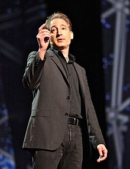

<table class="infobox biography vcard">
<tbody>
<tr>
<th colspan="2">

Brian Greene

</th>
</tr>
<tr>
<td colspan="2">

Brian Greene, February 28, 2012

</td>
</tr>
<tr>
<th scope="row">Born</th>
<td>

Brian Randolph Greene

 February 9, 1963&nbsp;(age&nbsp;57) 

<a title="New York City" href="https://en.wikipedia.org/wiki/New_York_City">New York City</a>, U.S.

</td>
</tr>
<tr>
<th scope="row">Nationality</th>
<td class="category">American</td>
</tr>
<tr>
<th scope="row">Alma&nbsp;mater</th>
<td><a title="Harvard University" href="https://en.wikipedia.org/wiki/Harvard_University">Harvard University</a>&nbsp;(<a title="Bachelor of Arts" href="https://en.wikipedia.org/wiki/Bachelor_of_Arts">BA</a>) <a title="Magdalen College, Oxford" href="https://en.wikipedia.org/wiki/Magdalen_College,_Oxford">Magdalen College, Oxford</a>&nbsp;(<a title="Doctor of Philosophy" href="https://en.wikipedia.org/wiki/Doctor_of_Philosophy">PhD</a>)</td>
</tr>
<tr>
<th scope="row">Known&nbsp;for</th>
<td><a title="String theory" href="https://en.wikipedia.org/wiki/String_theory">String theory</a> <em><a title="The Elegant Universe" href="https://en.wikipedia.org/wiki/The_Elegant_Universe">The Elegant Universe</a></em> <em><a title="The Fabric of the Cosmos" href="https://en.wikipedia.org/wiki/The_Fabric_of_the_Cosmos">The Fabric of the Cosmos</a></em> <em><a title="The Hidden Reality" href="https://en.wikipedia.org/wiki/The_Hidden_Reality">The Hidden Reality</a></em></td>
</tr>
<tr>
<th scope="row">Spouse(s)</th>
<td>Tracy Day</td>
</tr>
<tr>
<th scope="row">Awards</th>
<td><a title="Andrew Gemant Award" href="https://en.wikipedia.org/wiki/Andrew_Gemant_Award">Andrew Gemant Award</a>&nbsp;(2003)</td>
</tr>
<tr>
<td colspan="2"><strong>Scientific career</strong></td>
</tr>
<tr>
<th scope="row">Fields</th>
<td class="category"><a title="Physics" href="https://en.wikipedia.org/wiki/Physics">Physics</a></td>
</tr>
<tr>
<th scope="row">Institutions</th>
<td><a title="Cornell University" href="https://en.wikipedia.org/wiki/Cornell_University">Cornell University</a> <a title="Columbia University" href="https://en.wikipedia.org/wiki/Columbia_University">Columbia University</a></td>
</tr>
<tr>
<th scope="row"><a title="Doctoral advisor" href="https://en.wikipedia.org/wiki/Doctoral_advisor">Doctoral advisor</a></th>
<td><a title="Graham Ross (physicist)" href="https://en.wikipedia.org/wiki/Graham_Ross_(physicist)">Graham G. Ross</a> <a title="James Binney" href="https://en.wikipedia.org/wiki/James_Binney">James Binney</a></td>
</tr>
</tbody>
</table>
 

<strong>Brian Randolph Greene</strong>&nbsp;(born February 9, 1963) is an American&nbsp;<a class="mw-redirect" title="Theoretical physicist" href="https://en.wikipedia.org/wiki/Theoretical_physicist">theoretical physicist</a>,&nbsp;<a title="Mathematician" href="https://en.wikipedia.org/wiki/Mathematician">mathematician</a>, and&nbsp;<a class="mw-redirect" title="Super-string theory" href="https://en.wikipedia.org/wiki/Super-string_theory">string theorist</a>. He has been a&nbsp;<a title="Professor" href="https://en.wikipedia.org/wiki/Professor">professor</a>&nbsp;at&nbsp;<a title="Columbia University" href="https://en.wikipedia.org/wiki/Columbia_University">Columbia University</a>&nbsp;since 1996 and chairman of the&nbsp;<a title="World Science Festival" href="https://en.wikipedia.org/wiki/World_Science_Festival">World Science Festival</a>&nbsp;since co-founding it in 2008. Greene has worked on&nbsp;<a title="Mirror symmetry (string theory)" href="https://en.wikipedia.org/wiki/Mirror_symmetry_(string_theory)">mirror symmetry</a>, relating two different&nbsp;<a title="Calabi&ndash;Yau manifold" href="https://en.wikipedia.org/wiki/Calabi%E2%80%93Yau_manifold">Calabi&ndash;Yau manifolds</a>&nbsp;(concretely, relating the&nbsp;<a title="Conifold" href="https://en.wikipedia.org/wiki/Conifold">conifold</a>&nbsp;to one of its&nbsp;<a title="Orbifold" href="https://en.wikipedia.org/wiki/Orbifold">orbifolds</a>). He also described the&nbsp;<a title="Flop-transition" href="https://en.wikipedia.org/wiki/Flop-transition">flop transition</a>, a mild form of&nbsp;<a title="Topology" href="https://en.wikipedia.org/wiki/Topology">topology</a>&nbsp;change, showing that topology in&nbsp;<a title="String theory" href="https://en.wikipedia.org/wiki/String_theory">string theory</a>&nbsp;can change at the conifold point.

Greene has become known to a wider audience through his books for the general public,&nbsp;<em><a title="The Elegant Universe" href="https://en.wikipedia.org/wiki/The_Elegant_Universe">The Elegant Universe</a></em>,&nbsp;<em><a title="Icarus at the Edge of Time" href="https://en.wikipedia.org/wiki/Icarus_at_the_Edge_of_Time">Icarus at the Edge of Time</a></em>,&nbsp;<em><a title="The Fabric of the Cosmos" href="https://en.wikipedia.org/wiki/The_Fabric_of_the_Cosmos">The Fabric of the Cosmos</a>,</em>&nbsp;<em><a title="The Hidden Reality" href="https://en.wikipedia.org/wiki/The_Hidden_Reality">The Hidden Reality</a>,</em>&nbsp;and related&nbsp;<a class="mw-redirect" title="Public Broadcasting Service" href="https://en.wikipedia.org/wiki/Public_Broadcasting_Service">PBS</a>&nbsp;television specials. He also appeared on&nbsp;<em><a title="The Big Bang Theory" href="https://en.wikipedia.org/wiki/The_Big_Bang_Theory">The Big Bang Theory</a></em>&nbsp;episode "<a title="The Big Bang Theory (season 4)" href="https://en.wikipedia.org/wiki/The_Big_Bang_Theory_(season_4)#ep83">The Herb Garden Germination</a>", as well as the films&nbsp;<em><a title="Frequency (film)" href="https://en.wikipedia.org/wiki/Frequency_(film)">Frequency</a></em>&nbsp;and&nbsp;<em><a title="The Last Mimzy" href="https://en.wikipedia.org/wiki/The_Last_Mimzy">The Last Mimzy</a></em>. He is currently a member of the Board of Sponsors of the&nbsp;<em><a title="Bulletin of the Atomic Scientists" href="https://en.wikipedia.org/wiki/Bulletin_of_the_Atomic_Scientists">Bulletin of the Atomic Scientists</a></em>.&nbsp;Greene was also the narrator for the U.S. version of the preschool television series,&nbsp;<em><a title="Maisy" href="https://en.wikipedia.org/wiki/Maisy">Maisy</a></em>.

 
<h2> Technical Papers</h2>

<ul>

                             

 <li><a target="_blank" href="https://github.com/manjunath5496/Brian-Greene-Technical-Papers/blob/master/bgtp(1).pdf" style="text-decoration:none;">Black hole condensation and the unification of string vacua</a></li>

 <li><a target="_blank" href="https://github.com/manjunath5496/Brian-Greene-Technical-Papers/blob/master/bgtp(2).pdf" style="text-decoration:none;">Bouncing and cyclic string gas cosmologies</a></li>

<li><a target="_blank" href="https://github.com/manjunath5496/Brian-Greene-Technical-Papers/blob/master/bgtp(3).pdf" style="text-decoration:none;">Brane gases in the early universe: thermodynamics and cosmology</a></li>
 <li><a target="_blank" href="https://github.com/manjunath5496/Brian-Greene-Technical-Papers/blob/master/bgtp(4).pdf" style="text-decoration:none;">Brane-World Motion in Compact Dimensions</a></li>                              
<li><a target="_blank" href="https://github.com/manjunath5496/Brian-Greene-Technical-Papers/blob/master/bgtp(5).pdf" style="text-decoration:none;">Bubble Universe Dynamics After Free Passage</a></li>
<li><a target="_blank" href="https://github.com/manjunath5496/Brian-Greene-Technical-Papers/blob/master/bgtp(6).pdf" style="text-decoration:none;">A bulk inflaton from large-volume extra dimensions</a></li>
 <li><a target="_blank" href="https://github.com/manjunath5496/Brian-Greene-Technical-Papers/blob/master/bgtp(7).pdf" style="text-decoration:none;">Conifolds and Tunneling in the String Landscape</a></li>

 <li><a target="_blank" href="https://github.com/manjunath5496/Brian-Greene-Technical-Papers/blob/master/bgtp(8).pdf" style="text-decoration:none;"> Cosmological Moduli Dynamics</a></li>
   <li><a target="_blank" href="https://github.com/manjunath5496/Brian-Greene-Technical-Papers/blob/master/bgtp(9).pdf" style="text-decoration:none;">Dark Energy and Stabilization of Extra Dimensions</a></li>
  
 <li><a target="_blank" href="https://github.com/manjunath5496/Brian-Greene-Technical-Papers/blob/master/bgtp(10).pdf" style="text-decoration:none;">Decoupling in an expanding universe: backreaction barely constrains short distance effects in the CMB</a></li>

 <li><a target="_blank" href="https://github.com/manjunath5496/Brian-Greene-Technical-Papers/blob/master/bgtp(11).pdf" style="text-decoration:none;">Dynamical Decompactification and Three Large Dimensions</a></li>

<li><a target="_blank" href="https://github.com/manjunath5496/Brian-Greene-Technical-Papers/blob/master/bgtp(12).pdf" style="text-decoration:none;">An Effect of α′ Corrections on Racetrack Inflation</a></li>
 <li><a target="_blank" href="https://github.com/manjunath5496/Brian-Greene-Technical-Papers/blob/master/bgtp(13).pdf" style="text-decoration:none;">A generic estimate of trans-Planckian modifications to the primordial power spectrum in inflation</a></li>                              
<li><a target="_blank" href="https://github.com/manjunath5496/Brian-Greene-Technical-Papers/blob/master/bgtp(14).pdf" style="text-decoration:none;">Extracting New Physics from the CMB</a></li>
<li><a target="_blank" href="https://github.com/manjunath5496/Brian-Greene-Technical-Papers/blob/master/bgtp(15).pdf" style="text-decoration:none;">Families of Quintic Calabi–Yau 3–Folds with Discrete Symmetries</a></li>
 <li><a target="_blank" href="https://github.com/manjunath5496/Brian-Greene-Technical-Papers/blob/master/bgtp(16).pdf" style="text-decoration:none;">On the Hagedorn Behaviour of PP-wave Strings and N = 4 SYM Theory at Finite R-Charge Density</a></li>

 <li><a target="_blank" href="https://github.com/manjunath5496/Brian-Greene-Technical-Papers/blob/master/bgtp(17).pdf" style="text-decoration:none;"> Kink Collisions in Curved Field Space </a></li>
   <li><a target="_blank" href="https://github.com/manjunath5496/Brian-Greene-Technical-Papers/blob/master/bgtp(18).pdf" style="text-decoration:none;">The Origin of the Universe as Revealed Through the Polarization of the Cosmic Microwave Background</a></li>
  

 <li><a target="_blank" href="https://github.com/manjunath5496/Brian-Greene-Technical-Papers/blob/master/bgtp(19).pdf" style="text-decoration:none;">Random Field Theories in The Mirror Quintic Moduli Space</a></li>

<li><a target="_blank" href="https://github.com/manjunath5496/Brian-Greene-Technical-Papers/blob/master/bgtp(20).pdf" style="text-decoration:none;">Exploring Spiral Inflation in String Theory</a></li>
 <li><a target="_blank" href="https://github.com/manjunath5496/Brian-Greene-Technical-Papers/blob/master/bgtp(21).pdf" style="text-decoration:none;">String Windings in the Early Universe</a></li>                              
<li><a target="_blank" href="https://github.com/manjunath5496/Brian-Greene-Technical-Papers/blob/master/bgtp(22).pdf" style="text-decoration:none;">On three dimensions as the preferred dimensionality of space via the Brandenberger-Vafa mechanism</a></li>
<li><a target="_blank" href="https://github.com/manjunath5496/Brian-Greene-Technical-Papers/blob/master/bgtp(23).pdf" style="text-decoration:none;">Tumbling through a landscape: Evidence of instabilities in high-dimensional moduli spaces</a></li>
 <li><a target="_blank" href="https://github.com/manjunath5496/Brian-Greene-Technical-Papers/blob/master/bgtp(24).pdf" style="text-decoration:none;">Universal Correction to the Inflationary Vacuum</a></li>

 <li><a target="_blank" href="https://github.com/manjunath5496/Brian-Greene-Technical-Papers/blob/master/bgtp(25).pdf" style="text-decoration:none;"> Warped Vacuum Statistics </a></li>
   </ul>
